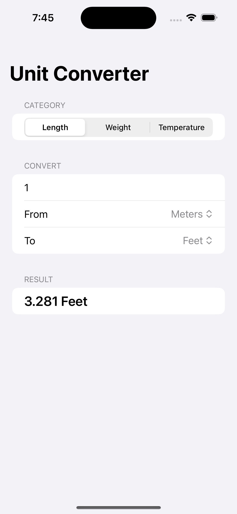

# Unit Converter

App 1 of 10 in a SwiftUI learning series.

## Goal

<!-- what you set out to learn with this app -->

## What it does

Converts values between units across three categories: length, weight, and temperature.

## Screenshot

## What I learned

<!-- fill in after building -->

## What I'd do differently

<!-- fill in after building -->
